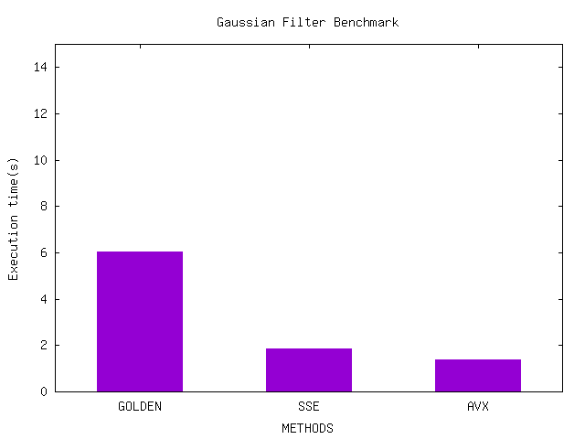
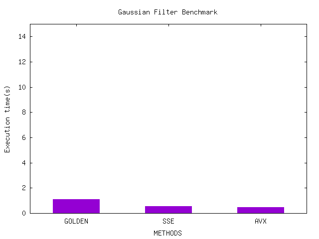
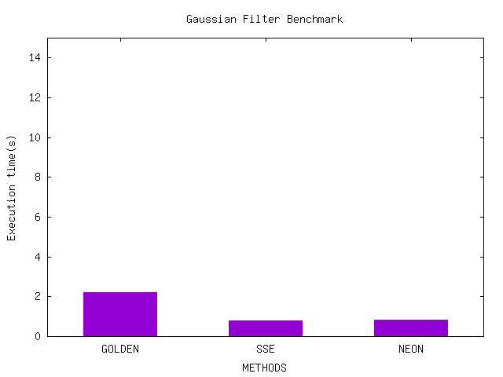
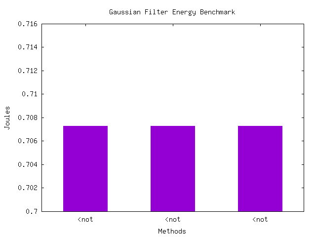
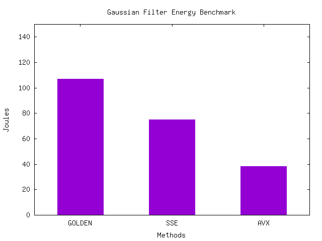

# Energy consumption for Gaussian Filter

## Benchmarking

To run benchmarks:

```sh
# 1. Run make to build project
make all
# 2. Script to run performance benchmarks
./scripts/bench.sh <host> <image>
# 3. Script to run energy benchmarks
./scripts/benchEnergy.sh <host> <image>
```

-------------

## Performance

### i7-9750H

1. Gaussian filter with Golden SSE and AVX versions



### i7-9750H - Work-station

1. Gaussian filter with Golden SSE and AVX versions



### Ryzen-3700X - Work-station

1. Gaussian filter with Golden SSE and AVX versions


### Apple Silicon: M1 Pro

1. Gaussian filter with Golden SSE and NEON versions




## Energy

### i7-9750H-Workstation

1. Gaussian filter with Golden SSE and AVX versions



### Ryzen-3700X - Work-station

1. Gaussian filter with Golden SSE and AVX versions


