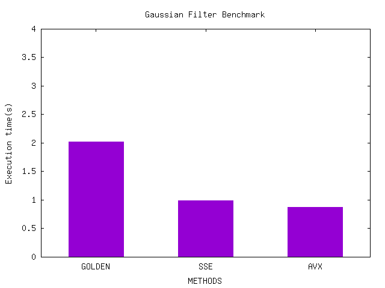
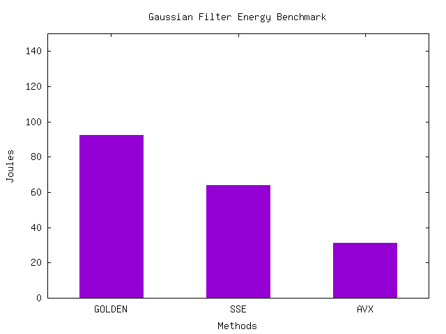

# Energy consumption for Gaussian Filter

## Benchmarking

To run benchmarks:

```sh
# 1. Run make to build project
make all
# 2. Script to run performance benchmarks
./scripts/bench.sh <host> <image>
# 3. Script to run energy benchmarks
./scripts/benchEnergy.sh <host> <image>
```

## To run with AVX512 using intel SDE emulator

Download the intel SDE emulator tar file. The extracted archive will contain an executable `sde64` which should be used to start the emulator / pass the command to be run by emulator.

```sh
# 1. Run make to build project, with AVX512 Floating Point support
make all OPT="-mavx512f"
# 2. Script to run performance benchmarks
<path_to_emulator>/sde64 <architecture> -- ./scripts/bench.sh <host> <image>
```

Run `<path_to_emulator>/sde64 --help` to know supported intel architectures

-------------

## Performance

### i7-9750H

1. Gaussian filter with Golden SSE and AVX versions


### i7-9750H - Work-station

1. Gaussian filter with Golden SSE and AVX versions


### Ryzen-3700X - Work-station

1. Gaussian filter with Golden SSE and AVX versions



### Apple Silicon: M1 Pro

1. Gaussian filter with Golden SSE and NEON versions


## Energy

### i7-9750H-Workstation

1. Gaussian filter with Golden SSE and AVX versions



### Ryzen-3700X - Work-station

1. Gaussian filter with Golden SSE and AVX versions


